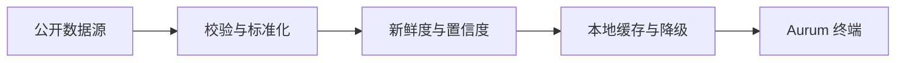

<div align="center">


# ₿ BTC Intelligence

### AURUM · Bitcoin Decision Terminal

**把价格、周期、链上、矿业与定投纪律，压缩成每天值得看一眼的 BTC 情报终端。**

[**打开正式站**](https://9992100.xyz/btc/) ·
[**GitHub Pages**](https://bwy999.github.io/btc-dca/) ·
[**AHR999 致敬专页**](https://9992100.xyz/btc/ahr999.html)


</div>

---

> **不预测明天，只校准今天的行动。**

BTC Intelligence 是一款面向长期比特币持有者与定投者的移动端信息终端。

它不试图用单一指标预测价格，而是把长期结构、估值位置、网络基本面、市场流动性和个人执行计划放在同一套可验证的框架中。最终目标只有一个：在市场最嘈杂的时候，仍然知道自己处于哪里、应该观察什么，以及哪些动作不该做。

不自动交易，不鼓励杠杆，不承诺收益。

## Terminal Map

| 层级 | 核心模块 | 回答的问题 |
|:---|:---|:---|
| **状态** | 今日情报、实时价格、数据置信度 | 今天的 BTC 处于什么状态？ |
| **结构** | 市场图谱、均线、减半坐标、周期雷达 | 当前趋势与历史周期如何对应？ |
| **估值** | 幂律走廊、AHR999、双锚底价、七维评分 | 价格相对长期价值处于哪里？ |
| **网络** | 全网算力、挖矿难度、矿工收入与成本 | 比特币网络是否持续增强？ |
| **资金** | 恐惧贪婪、资金费率、现货溢价、稳定币 | 市场情绪与流动性是否过热？ |
| **执行** | 21M 积累、永久仓、预算、回撤档位、买入记录 | 如何把判断转化为可重复的纪律？ |

## Core Intelligence

### Long-Term Power Law

完整 BTC 历史价格与三条长期幂律模型线同屏展示：

- **支撑线** — 长期压力区参考
- **公允线** — 时间回归中枢
- **阻力线** — 历史周期顶部参考
- **区间位置** — 当前价格在支撑与阻力之间的位置
- **偏离度** — 现价相对公允价值的距离
- **领先支撑** — 当前价格相当于未来何时的模型支撑

```text
公允价 = 10^-17.016  × d^5.845
支撑价 = 10^-17.466  × d^5.845
阻力价 = 10^-13.3663 × d^5.0293
```

其中 `d` 为自 2009-01-03 创世区块以来的天数。历史价格覆盖 2010 年至今，模型延伸至 2035 年。

### Dual Floor System

两种独立口径交叉观察长期压力区：

| 模型 | 方法 | 主要输出 |
|:---|:---|:---|
| **Bitview CM Floor** | 历史样本尾部分位 | `p95`、`p99`、`p99.5` 压力价格 |
| **UTXO Floor Band** | UTXO 加权中位成本与历史左尾分位 | 成本锚 `C50`、常见压力底 `5%`、极端压力底 `2%` |

底价是历史结构参考，不是不会跌破的价格保证。

### Mining Fundamentals

算力与难度使用两张独立图表，避免双轴造成误读：

- 支持 `3月 / 1年 / 3年 / 全部` 四档范围
- 算力采用周均面积线，观察网络安全预算与矿工投入
- 难度采用阶梯线，还原每个调整周期内的真实协议状态
- 长周期数据使用保形抽样，手机端也能完整显示全历史
- 全周期变化使用紧凑增长倍数，避免极大百分比失去可读性

### AHR999 & Valuation Engine

AHR999 是这个项目的精神原点，也是长期定投成本与时间价值的重要坐标。

主终端同时跟踪：

`AHR999` · `价格 / 200WMA` · `MVRV` · `恐惧贪婪` · `Puell Multiple` · `Reserve Risk` · `SOPR`

七维评分会根据数据新鲜度与可靠性动态校准。实时、缓存、滞后与缺失状态均明确显示，不用过期数据制造确定性。

独立的 [`ahr999.html`](https://9992100.xyz/btc/ahr999.html) 提供经典与重拟合模型、完整公式、历史曲线和关键价格。

## Accumulation System

- **21M 长期积累** — BTC、sats、永久仓目标与 2100 万分之一占比
- **三池预算** — 基础定投、回撤加仓、极端预备金分离
- **五档回撤** — 触发、执行与等待状态独立记录
- **持仓视图** — 现货、ETF 与网格统一观察
- **个人成本曲线** — 累计投入、持仓市值与买入日标记
- **本地备份** — 通过 JSON 导入、导出个人数据

```text
不追涨 · 不改买点 · 不停定投
不加杠杆 · 不动备用金 · 买入后转冷钱包
```

## Data Integrity



| 数据域 | 主要来源 | 失效策略 |
|:---|:---|:---|
| 现价与交易结构 | Binance、OKX、Coinbase、CoinGecko | 多源轮询与备用价格 |
| 长期价格与矿业 | mempool.space、Blockchain.com | 全历史主备切换 |
| 链上与周期 | Coin Metrics、BGeometrics、bitcoin-data.com | 缓存沿用并标注状态 |
| 情绪与流动性 | Alternative.me、DefiLlama | 保留最近有效值 |
| 统计与 UTXO 底价 | Bitview、`floor.json` | 内置快照与本地文件降级 |
| 市场隐含概率 | Polymarket | 过滤关闭或失效市场 |

缓存按数据属性分层：

- 核心实时数据：约 **30 分钟**
- 矿业历史与 CM Floor：约 **6 小时**
- 幂律价格历史与 UTXO 底价：约 **24 小时**

所有关键模块都遵循同一原则：接口失败时保留最近一次有效数据，并明确显示来源与新鲜度；不伪造历史，不把缓存冒充实时。

## Local-First Privacy

- 预算、持仓、买入记录与偏好保存在当前浏览器
- 无账户系统、无自建数据后台、无行为分析埋点
- 可选 BGeometrics API Key 仅保存在当前设备
- API Key 不写入 HTML，也不包含在 JSON 备份中

> 清理浏览器数据或更换设备前，请先导出 JSON 备份。

## Quick Start

项目使用原生 HTML、CSS 与 JavaScript，无 npm、无构建步骤。

```bash
git clone https://github.com/Bwy999/btc-dca.git
cd btc-dca
python3 -m http.server 8080
```

浏览器打开 `http://localhost:8080`。

也可以直接部署到 GitHub Pages、Cloudflare Pages、Vercel、Nginx 或任意静态文件服务。

### GitHub Pages

1. 将生产版本保存为仓库根目录的 `index.html`
2. 在仓库 `Settings → Pages` 中选择 `main` 分支与根目录
3. 等待 Pages 完成部署

### Existing VPS Workflow

当前生产链路以 GitHub `main/index.html` 为入口。更新时将最新版本覆盖根目录 `index.html` 并推送，VPS 即可按现有同步任务更新。

`vps-install-bitview-floor.sh` 用于安装 CM Floor 更新任务：每 6 小时校验远端数据，并原子更新站点目录中的 `floor.json`。

## Project Structure

```text
btc-dca/
├── index.html                     # 主终端 · 单文件生产入口
├── ahr999.html                    # AHR999 独立致敬专页
├── floor.json                     # CM Floor 本地快照
├── vps-install-bitview-floor.sh   # Floor 定时更新脚本
├── apple-touch-icon.png           # iOS / PWA 图标
└── README.md
```

## Mobile Experience

- 针对 iPhone 安全区与触摸操作优化
- 支持深色 / 浅色主题
- Safari 可通过“分享 → 添加到主屏幕”作为 Web App 使用
- 图表支持触摸悬停与长周期范围切换
- 回到前台时按 TTL 静默检查并更新懒加载模块

## Build

```text
Version   V21.6.2
Build     21.6.2-20260729
Codename  Aurum Power Law
Runtime   Modern Browser
Stack     Vanilla HTML / CSS / JavaScript
```

## Disclaimer

本项目是个人信息整理、市场研究与定投纪律工具，不构成投资建议、收益承诺或交易指令。

任何模型都可能失效，任何历史底部都可能被跌破。请根据自身财务状况独立判断，避免杠杆，并始终保留生活备用金。

---

<div align="center">

*如果有一天你特难受，特绝望，特孤独。*  
*你感觉全世界只有你还相信比特币，*  
*你开始动摇了，你快要撑不住了。*  
*相信我，其实你并不孤独。*

### 我们都是中本聪！

<sub>—— ahr999 九神</sub>

</div>
